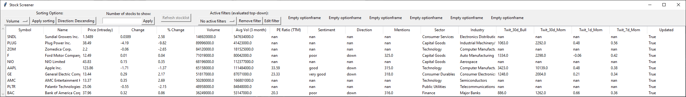

# Stock Screener
This project is an attempt at creating a stock screener to quickly gather information about popular stocks. It is inspired by and uses code the following sources:
- https://medium.com/swlh/stock-market-screening-and-analysis-using-web-scraping-neural-networks-and-regression-analysis-f40742dd86e0
- https://medium.com/analytics-vidhya/sentiment-analysis-for-trading-with-reddit-text-data-73729c931d01
- https://towardsdatascience.com/sentimental-analysis-using-vader-a3415fef7664

The program consists of a Graphical User Interface (GUI):

The GUI consists of the following components:
- Option bar: Located at the top of the window and contains various buttons to filter, sort, etc. the stocks.
- Table view: Below the option bar a table with stocks is located. The top row of the table contains the column headings and every other row contains stocks.

## Program structure
The structure of the program can be seen in this state diagram:

## Setup instructions
1. Create a python virtual environment, preferably called *.venv*
2. Activate it with *source .venv/Scripts/activate*
3. Install python packages with *python3 -m pip install -r requirements.txt*
